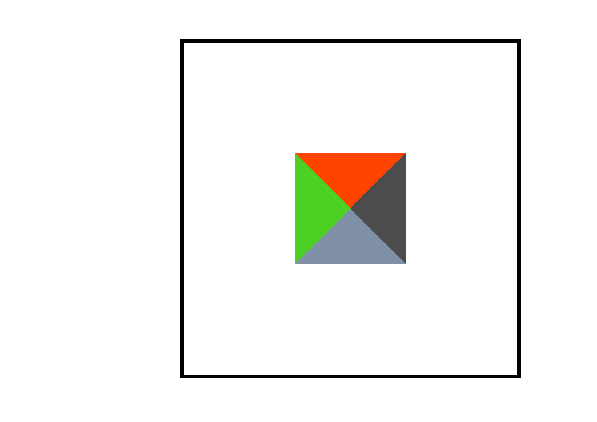

## 轴

xy同之前的方向是一致的,z由屏幕内指外

## 变形操作

使用 `transform` 规则控制元素的变形操作，包括控制移动、旋转、倾斜、3D转换等，下面会详细介绍每一个知识点。

下面是CSS提供的变形动作。

| 选项                  | 说明                                  |
| --------------------- | ------------------------------------- |
| none                  | 定义不进行转换。                      |
| translate(x,y)        | 定义 2D 转换。                        |
| translate3d(x,y,z)    | 定义 3D 转换。                        |
| translateX(x)         | 定义转换，只是用 X 轴的值。           |
| translateY(y)         | 定义转换，只是用 Y 轴的值。           |
| translateZ(z)         | 定义 3D 转换，只是用 Z 轴的值。       |
| scale(x,y)            | 定义 2D 缩放转换。                    |
| scale3d(x,y,z)        | 定义 3D 缩放转换。                    |
| scaleX(x)             | 通过设置 X 轴的值来定义缩放转换。     |
| scaleY(y)             | 通过设置 Y 轴的值来定义缩放转换。     |
| scaleZ(z)             | 通过设置 Z 轴的值来定义 3D 缩放转换。 |
| rotate(angle)         | 定义 2D 旋转，在参数中规定角度。      |
| rotate3d(x,y,z,angle) | 定义 3D 旋转。                        |
| rotateX(angle)        | 定义沿着 X 轴的 3D 旋转。             |
| rotateY(angle)        | 定义沿着 Y 轴的 3D 旋转。             |
| rotateZ(angle)        | 定义沿着 Z 轴的 3D 旋转。             |
| skew(x-angle,y-angle) | 定义沿着 X 和 Y 轴的 2D 倾斜转换。    |
| skewX(angle)          | 定义沿着 X 轴的 2D 倾斜转换。         |
| skewY(angle)          | 定义沿着 Y 轴的 2D 倾斜转换。         |
| perspective(n)        | 为 3D 转换元素定义透视视图。          |


PS:CSS 数据类型 `<angle>` 用于表示角的大小，单位为度（degrees）、 百分度（gradians）、弧度（radians）或圈数（turns）。

## 行级元素

行级元素不产生变形效果，将其转为 `inline-block` 或 `block` 以及弹性元素时都可以产生变化效果。

## 移动translate

### 2D水平移动

```css
    main:hover div:nth-child(2) {
    transform: translateX(50%) translateY(100px);
    /* translate(x,y) 可以直接同时设置xy*/
    }
```
用于向右下方移动
`50%`是相对于自身而言的.


### 3D移动

先透视并旋转一下(暂时不讨论这一些属性)

```css
    transform: perspective(900px) rotateY(45deg);
```

这样就可以做到Z轴上的移动,简写值可以直接看上表(Z轴方向不能设置`%`)

```css
    transform: perspective(900px) rotateY(45deg) translateZ(200px);
```

## 缩放scale

### 2D缩放

这个和前面的是一样的,`0.5`代表缩放成0.5倍
```css
transform: scale(0.5, 2)
```

### 3D缩放

```css
    main {
        position: absolute;
        top: 50%;
        left: 50%;
        width: 300px;
        height: 300px;
        margin-top: -150px;
        margin-left: -150px;
        border: 3px solid #000;
        transform: perspective(900px) rotateY(45deg);
        transform-style: preserve-3d;
    }

    div {
        position: absolute;
        top: 100px;
        left: 100px;
    }

    div:nth-child(1) {
        background-color: #4cd137;
        width: 100px;
        height: 100px;
        transition: 1s;
    }

    div:nth-child(2) {
        background-color: #00a8ff;
        width: 100px;
        height: 100px;
        transform: translateZ(-300px);
        transition: 1s;
    }

    body {
        width: 100vw;
        width: 100vh;
    }

    body:hover main {
        transform: perspective(900px) rotateY(45deg) scaleZ(2);
    }
```

属性
`scaleZ(2)`


**Z轴方向相当于拉伸盒子z轴**

简写值看上面表吧

## 旋转rotate

### 水平旋转

`rotateX`
按水平轴发生旋转，如果旋转90deg 将不可见



### 垂直旋转

`rotateY`
按垂直轴旋转，如果旋转90deg 将不可见。

下面这是旋转了290度


### 普通的旋转

`rotateZ`
让一个元素围绕横Z轴旋转这才是常见的旋转吧,这是一个顺时针的时钟效果

### rotate

`rotate`控制xy轴上的旋转效果和`rotateZ`是一样的,不能理解成`rotateX(45deg) rotateY(45deg);`这样的效果

### rotate3d

```css
    rotate3d(x,y,z,a);
```

x/y/z: &lt;number&gt; 类型，可以是0到1之间的数值，表示旋转轴x/y/z坐标方向的矢量。(成比例变化结果是一样的,如果这些矢量被赋予非标准值，即3个坐标值的平方和不等于1时，它将会被内部隐式标准化。)
a: &lt;angle&gt; 类型，表示旋转角度。正的角度值表示顺时针旋转，负值表示逆时针旋转。

## 倾斜操作skew

`skewX(angle)` 沿x轴倾斜
`skewY` 沿y轴倾斜
`skew` 沿x/y轴倾斜,只设置一个值时,y轴倾斜为0
