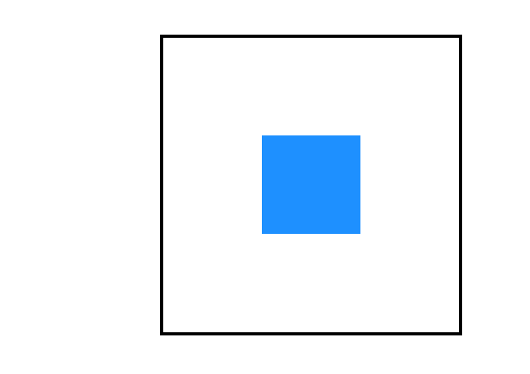

## 变形基点

使用`tansform-origin`设置元素的X/Y/Z的操作基点,用于控制旋转和倾斜等操作

- 旋转默认以元素中心进行旋转，改变基点后可控制旋转点位置
- 元素移动不受变形基点所影响

[MDN上介绍的不能再详细了,还可以直接看到旋转中心](https://developer.mozilla.org/zh-CN/docs/Web/CSS/transform-origin)

### 平面旋转



```html
    <main>
        <div></div>
        <div></div>
    </main>
```

```css
  div {
    position: absolute;
    top: 100px;
    left: 100px;
    width: 100px;
    height: 100px;
    transform-origin: right bottom;
  }

  div:nth-child(1) {
      background-color: #4cd137;
      transition: 1s;
  }

  div:nth-child(2) {
      background-color: #1e90ff;
      transition: 1s;

  }

  main:hover div:nth-child(2) {
      transform: rotateZ(45deg);
  }
```

### 倾斜控制

默认中线倾斜


### 3维旋转

`tansform-origin`第三个值用来表现z轴上的偏移量(注意,这个值没有预设单词,也不能使用百分比,只能是数值)

## 透视景深

### perspective

- 使用 `perspective` 来控制元素的透视景深
- `perspective` 规则为舞台元素控制景深， `perspective` 属性为控制单个元素

```css
    perspective: 200px;
```

>当该属性值不为 0 和 none 时，会创建新的 层叠上下文。在这种情况下，容器内元素的层叠关系像是使用了 `position: fixed` 一样。

perspective 函数用于为元素设置单独透视，下面是为元素单独设置透视参数，每个元素的透视效果是一样的。

```css
    transform: perspective(100px) rotateY(60deg);
```

## 3D透视

这是一个实验中的属性
CSS 属性 transform-style 设置元素的子元素是位于 3D 空间中还是平面中。

```css
    transform-style: flat;
    transform-style: preserve-3d;
```

## 观看视角

CSS 属性 `perspective-origin` 指定了观察者的位置，用作 `perspective` 属性的消失点。

[MDN中的介绍](https://developer.mozilla.org/zh-CN/docs/Web/CSS/perspective-origin)

## 隐藏背面

`backface-visibility`指定当元素背面朝向观察者时是否可见。

```css
    backface-visibility: visible;  /*背面朝向用户时可见*/
    backface-visibility: hidden;    /*背面朝向用户时不可见*/
```