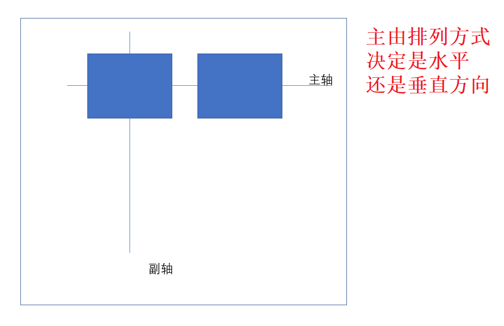

## 定义

article是盒子
div是盒子中的元素

```html
    <article>
        <div> 1</div>
        <div> 2</div>
        <div> 3</div>
    </article>
```

## 定义盒子的方法

给盒子加上
```css
    display:flex; /*类似于块级*/
    display:inline-flex; /*类似于行级*/
```

## 弹性元素的排列

也是给盒子加
```css
    flex-direction : row;  /*默认,水平左到右*/
    flex-direction : row-reverse; /*水平右到左排列*/
    flex-direction : column; /*垂直*/
    flex-direction : column-reverse;
```

## 换行

当行或者列放不下时

给盒子加上

```css
    flex-wrap: wrap; /* 直接将溢出换行 */
    flex-wrap: wrap-reverse; /* 反向处理 */
```

排列和换行可以用一个组合设置

```css
    flex-flow: row wrap-reverse;
```

## 弹性轴



## 主轴的设置

`justify-content`用来设置弹性盒子中各项周围的空白

```css
div{
    display: flex;
    justify-content: space-around;
}
```

```css
    flex-start 开始
    flex-end 结束
    center 中间
    space- 空间分布的方式
    space-evenly 空白完全平均分布
```

## 交叉轴的设置

`align-items` 侧轴（副轴）方向上的对齐方式。

`align-center` 用来设置弹性盒子中各项交叉轴方向的周围的空白(`justify-content`)

## 设置单个弹性元素

对单个元素进行设置

`align-self` 对单个元素进行设置

```css
    align-self:flex-start;
```

`flex-grow` 设置可用空间占几等分(设置为0保持自己)


`flex-shrink` 设置溢出却没换行时的缩小比例(设置为0为不缩小)


`flex-basis` 基准尺寸

上面三条简写成`flex`

`order` 控制排序(数值越大越靠后)