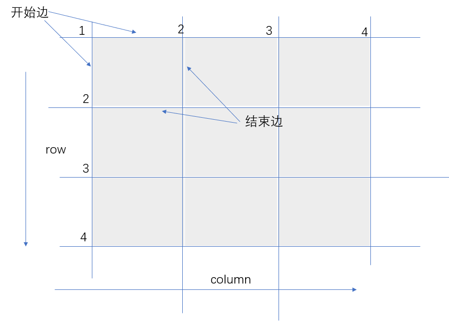
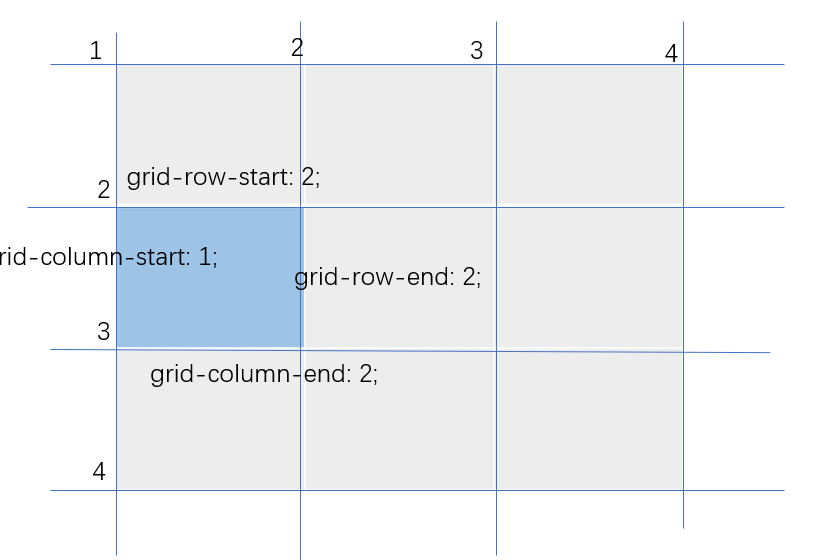
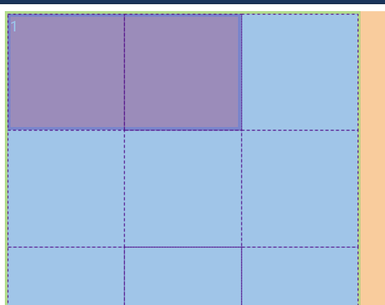
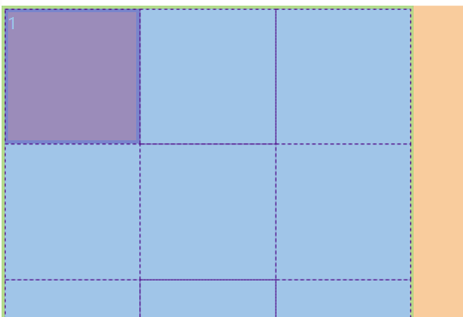
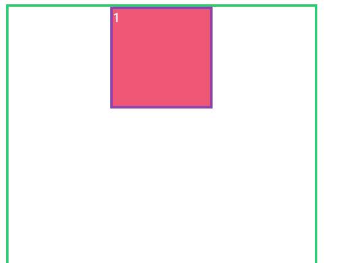
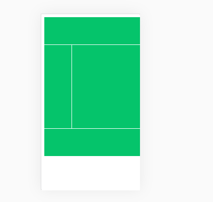

## 定义栅格

```css
    display:grid;
    display:inline-grid;
```

## 设置行列

### 直接分配
两行四列
```css
    grid-template-rows: 50% 50%;
    grid-template-columns: 25% 25% 25% 25%;
```

### 使用重复分配
上面可以用以下方法

```css
    grid-template-rows: repeat(5, 50%);
     grid-template-columns: repeat(4, 25%);
```

还可以设置成这样

行分布上,一个100px,下一个50px,并且重复两次(就是分成4列)
列分布上同上,分成2行

```css
    grid-template-rows: repeat(2, 100px 50px);
    grid-template-columns: repeat(1, 90px 80px);
```

### 按比例分配

1:2:1的进行分配空间

```css
    grid-template-rows: 1fr 2fr 1fr;
    grid-template-columns: 1fr 2fr 1fr;
```

## minmax()函数

用于设置最小值和最大值

```css
    grid-template-rows: minmax(50px,100px);
```

## 栅格的间距

```css
    column-gap: 20px;
    row-gap: 5px;
```

上面两个的简写属性`gap`


## 栅格线编号





```css
    div:first-child {
    grid-row-start: 2;
    grid-column-start: 1;
    grid-row-end: 2;
    grid-column-end: 2;
    background-color: #ef5777;
}
```
规则的矩形(正方形)都是可以设置的,不规则暂时是不可以的

### 用命名代替编号

命名可以根据自己喜好命名,中间的线可以用两个名字表示

栅格设置
```css
    grid-template-rows: [r1-s] 1fr [r1-e r2-s] 1fr [r2-e r3-s]1fr[r3-e];
    grid-template-columns: [c1-s] 1fr [c1-e c2-s] 1fr [c2-e c3-s]1fr[c3-e];
```

给元素设置
```css
    div:first-child {
    grid-row-start: r1-s;
    grid-column-start: c1-s;
    grid-row-end: r1-e;
    grid-column-end: c3-s;
    background-color: #ef5777;
}
```



#### 重复的命名设置

```css
grid-template-rows: repeat(3, [r-start] 1fr [r-end]);
grid-template-columns: repeat(3, [c-start] 1fr [c-end]);
```

```css    
div:first-child {
    grid-row-start: r-start 1;
    grid-column-start: c-start 1;
    grid-row-end: r-start 2;
    grid-column-end: c-end 1;
    background-color: #ef5777;
}
```



## span偏移量

span表示偏移几格

```css
    div:first-child {
        grid-row-start: 2;
        grid-column-start: 2;
        grid-row-end: span 1;
        grid-column-end: span 1;
    }
```

## 元素控制的简写属性

```css
    grid-row: 1/2;
    grid-column: 2/3;
```



也可写成下面这一种模式

```css
    grid-row: 1/span 1;
    grid-column: 2/ span 1;
```

###　 grid-area

上面的可以直接简写成` grid-area:1/1/2/2;`

##　使用区域进行布局

```html
<div>
    <header></header>
    <main></main>
    <nav></nav>
    <footer></footer>
</div>
```

```css
    div {
        width: 500px;
        height: 500px;
        display: grid;
        grid-template-rows: 100px 1fr 100px;
        grid-template-columns: 100px 1fr;
        grid-template-areas: "header header"
            "nav main"
            "footer footer";
    }

    header,
    nav,
    main,
    footer {
        background-color: #05c46b;
        background-clip: content-box;
        padding: 1px;
    }

    header {
        grid-area: header;
    }

    main {
        grid-area: main;
    }

    nav {
        grid-area: nav;
    }

    footer {
        grid-area: footer;
    }
```



### 区域命名

系统会自动为使用区域的栅格进行命名

上面的例子可能就产生,上面是`header-start`的名称,最后一条线是`footer-end`

### 区域占位

当某些地方用栅格画好区域不需要动,而其余部分需要分区就可以使用这种方法
使用一个或多个连续`.`定义区域占位。

```css
    grid-template-areas: ".. .."
    "... ..."
    "footer footer";
```

## 栅格流动

在容器中设置`grid-auto-flow` 属性可以改变单元流动方式。
| 选项   | 说明     |
| ------ | -------- |
| column | 按列排序 |
| row    | 按行排序 |

### 强制填充

当元素在栅格中放不下时，将会发生换行产生留白，使用`grid-auto-flow: row dense;` 可以执行填充空白区域操作。

## 栅格对齐

可以通过属性方便的定义栅格的对齐方式，可用值包括` start | end | center | stretch | space-between | space-evenly | space-around`。

| 选项                                | 说明                                             | 对象     |
| ----------------------------------- | ------------------------------------------------ | -------- |
| align-items                         | 栅格内所有元素的垂直排列方式                     | 栅格容器 |
| justify-items                       | 栅格内所有元素的横向排列方式                     | 栅格容器 |
| justify-content                     | 所有栅格在容器中的水平对齐方式，容器有额外空间时 | 栅格容器 |
| align-content                       | 所有栅格在容器中的垂直对齐方式，容器有额外空间时 | 栅格容器 |
| align-self	元素在栅格中垂直对齐方式 | 栅格元素                                         |
| justify-self                        | 元素在栅格中水平对齐方式                         | 栅格元素 |

### 简写属性
`place-content`
用于控制栅格的对齐方式，语法如下：

```css
    place-content: <align-content> <justify-content>
```

`place-items`
控制所有元素的对齐方式，语法结构如下：

```css
    place-items: <align-items> <justify-items>
```

`place-self`
控制单个元素的对齐方式

```css
    place-self: <align-self> <justify-self>
```
