注意: W是window的缩写,E是Element,HE是HTMLElement

​			篇幅问题,写left省略top,height省略width,等等


# W.getComputedStyle() (css属性)

`Window.getComputedStyle()`方法返回一个对象，该对象在应用活动样式表并解析这些值可能包含的任何基本计算后报告元素的所有CSS属性的值。 私有的CSS属性值可以通过对象提供的API或通过简单地使用CSS属性名称进行索引来访问。

```javascript
let style = window.getComputedStyle(element, [pseudoElt]);
//第二个参数省略或null,或者指定需要匹配的伪元素的字符串
```


# E.getBoundingClientRect() (元素大小和位置)

`Element.getBoundingClientRect()` 方法返回元素的大小及其相对于视口的位置。大小包括边框和padding


```html
  <style>
      * {
        padding: 0;
        margin: 0;
      }
      main {
        width: 100px;
        height: 100px;
        background-color: beige;
        border-top: 20px solid red;
        margin-top: 100px;
        margin-left: -100px;
        padding-left: 50px;
      }
    </style>
  </head>
  <body>
    <main></main>
    <script>
      const main = document.getElementsByTagName('main')[0];
      console.log((a = main.getBoundingClientRect()));
    </script>
  </body>
```


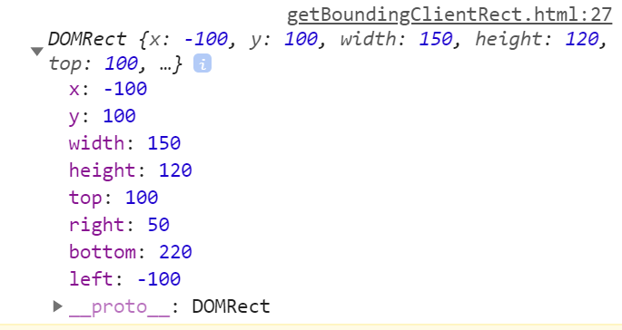


**可见的位置的计算**


# W.innerHeight (视口尺寸)

浏览器窗口的视口（viewport）高度（以像素为单位）；如果有水平滚动条，也包括滚动条高度。

任何窗口对象，如 [`window`](https://developer.mozilla.org/zh-CN/docs/Web/API/Window)、frame、frameset 或 secondary window 都支持 `innerHeight` 属性。

有一个[算法](https://bugzilla.mozilla.org/show_bug.cgi?id=189112#c7)用来获取不包括水平滚动条的视口高度。

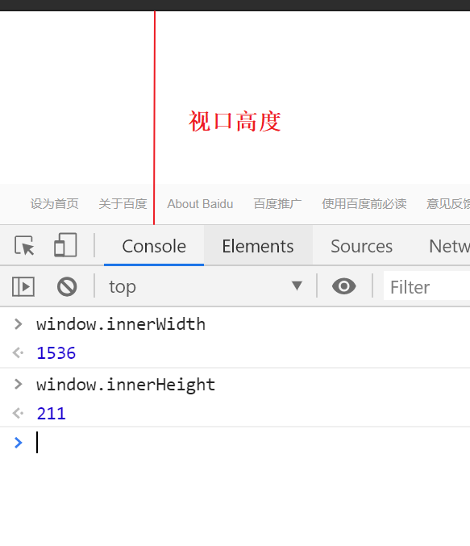

# W.outerHeight (浏览器尺寸)

`Window.outerHeight` 获取整个浏览器窗口的高度（单位：像素），包括侧边栏（如果存在）、窗口镶边（window chrome）和窗口调正边框（window resizing borders/handles）。

该属性为只读，没有默认值。

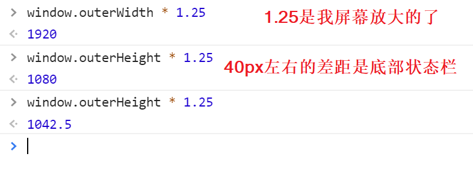

下面的示意图展示了 `outerHeight` 和 `innerHeight` 两者的不同。


# W.scrollX (滚动条位置)

返回文档/页面水平方向滚动的像素值。


`pageXOffset` 属性是 `scrollX` 属性的别名：

为了跨浏览器兼容性，请使用 `window.pageXOffset` 代替 `window.scrollX`。另外，旧版本的 IE（<9）两个属性都不支持，必须通过其他的非标准属性来解决此问题。完整的兼容性代码如下：


```JavaScript
var x = (window.pageXOffset !== undefined) ? window.pageXOffset : (document.documentElement || document.body.parentNode || document.body).scrollLeft;
var y = (window.pageYOffset !== undefined) ? window.pageYOffset : (document.documentElement || document.body.parentNode || document.body).scrollTop;
```


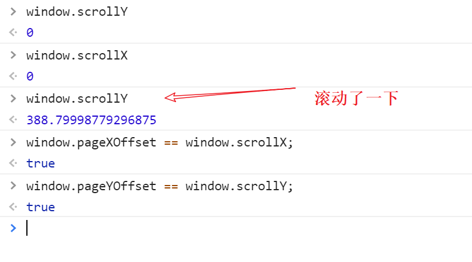


# W.screen (渲染窗口中和屏幕有关的属性)

返回当前window的screen对象。screen对象实现了[`Screen`](https://developer.mozilla.org/zh-CN/docs/Web/API/Screen)接口，它是个特殊的对象，返回当前渲染窗口中和屏幕有关的属性。

https://developer.mozilla.org/zh-CN/docs/Web/API/Screen


# W.screenX (桌面到浏览器)

返回浏览器左边界到操作系统桌面左边界的水平距离。


**火狐**

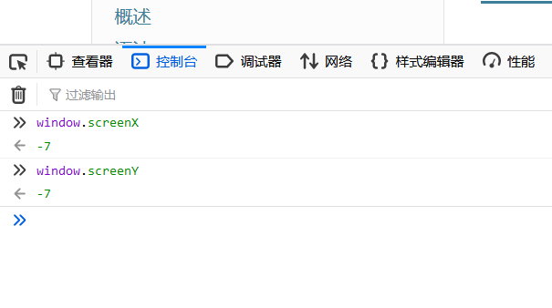

**chrome**

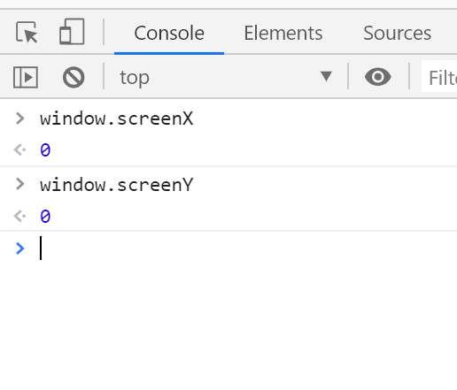

# W.screenLeft (ie牛逼)

```
window.screenLeft === window.screenX 
```

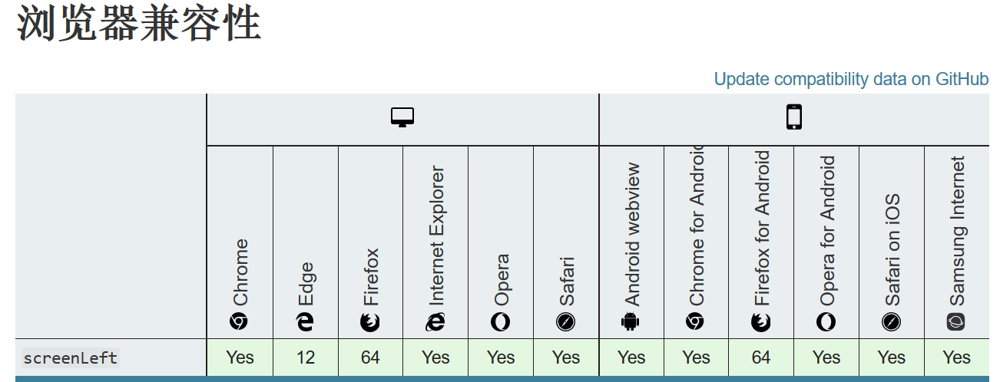


# E.clientWidth (width + padding)

内联元素以及没有 CSS 样式的元素的 `clientWidth` 属性值为 0。`Element.clientWidth` 属性表示元素的内部宽度，以像素计。该属性包括内边距 padding，但不包括边框 border、外边距 margin 和垂直滚动条（如果有的话）。

高度:`Element.clientHeight`

注意:结果四舍五入成整数

```html
  	<style>
      * {
        padding: 0;
        margin: 0;
      }
      main {
        width: 100px;
        height: 100px;
        background-color: beige;
        border-top: 20px solid red;
        margin: 100px;
        padding-left: 50px;
      }
    </style>
  </head>
  <body>
    <main></main>
    <script>
      const main = document.getElementsByTagName('main')[0];
      console.log('clientWidth', (a = main.clientWidth)); //150
      console.log('clientHeight', (b = main.clientHeight)); //100
    </script>
  </body>
```


# HE.offsetWidth (width + border + padding)

`HTMLElement.offsetWidth` 是一个只读属性，返回一个元素的布局宽度。一个典型的（译者注：各浏览器的offsetWidth可能有所不同）offsetWidth是测量包含元素的边框(border)、水平线上的内边距(padding)、竖直方向滚动条(scrollbar)（如果存在的话）、以及CSS设置的宽度(width)的值。

只读,四舍五入

```html
   <style>
      * {
        padding: 0;
        margin: 0;
      }
      main {
        width: 100px;
        height: 100px;
        background-color: beige;
        border-top: 20px solid red;
        margin: 100px;
        padding-left: 50px;
      }
    </style>
  </head>
  <body>
    <main></main>
    <script>
      const main = document.getElementsByTagName('main')[0];
      console.log('offsetWidth', (a = main.offsetWidth));  //150
      console.log('offsetHeight', (b = main.offsetHeight)); //120
    </script>
  </body>
```


# E.scrollWidth (E.clientWidth的支持scroll版本)

**`Element.scrollWidth`** 这个只读属性是元素内容宽度的一种度量，包括由于overflow溢出而在屏幕上不可见的内容。

`scrollWidth`值等于元素在不使用水平滚动条的情况下适合视口中的所有内容所需的最小宽度。 宽度的测量方式与[`clientWidth`](https://developer.mozilla.org/zh-CN/docs/Web/API/Element/clientWidth)相同：它包含元素的内边距，但不包括边框，外边距或垂直滚动条（如果存在）。 它还可以包括伪元素的宽度，例如[`::before`](https://developer.mozilla.org/zh-CN/docs/Web/CSS/::before)或[`::after`](https://developer.mozilla.org/zh-CN/docs/Web/CSS/::after)。 如果元素的内容可以适合而不需要水平滚动条，则其`scrollWidth`等于[`clientWidth`](https://developer.mozilla.org/zh-CN/docs/Web/API/Element/clientWidth)


```html
   <style>
      * {
        padding: 0;
        margin: 0;
      }
      div {
        width: 80px;
        overflow: hidden;
        margin: 100px;
      }
      main {
        width: 100px;
        height: 100px;
        background-color: beige;
        border-top: 20px solid red;
        padding-left: 50px;
      }
    </style>
  </head>
  <body>
    <div>
      <main></main>
    </div>
    <script>
      const div = document.getElementsByTagName('div')[0];
      console.log('scrollWidth', (a = div.scrollWidth));
      console.log('scrollHeight', (b = div.scrollHeight));
      console.log('clientWidth', (a = div.clientWidth));
      console.log('clientHeight', (b = div.clientHeight));
    </script>
  </body>
```

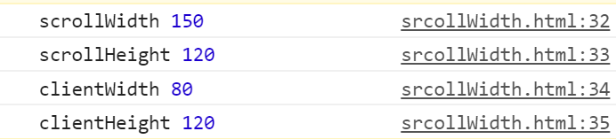


# El.clientLeft (上和左的滚动条+border)

表示一个元素的**左边框的宽度**，以像素表示。如果元素的文本方向是从右向左（RTL, right-to-left），并且由于内容溢出导致左边出现了一个垂直滚动条，则该属性包括滚动条的宽度。`clientLeft` 不包括左外边距和左内边距。`clientLeft` 是只读的。

```html
   <style>
      * {
        padding: 0;
        margin: 0;
      }
      main {
        width: 100px;
        height: 100px;
        background-color: beige;
        border-top: 20px solid red;
        margin: 100px;
        padding-left: 50px;
      }
    </style>
  </head>
  <body>
    <main></main>
    <script>
      const main = document.getElementsByTagName('main')[0];
      console.log('clientLeft', (a = main.clientLeft)); //0
      console.log('clientTop', (b = main.clientTop)); //20
    </script>
  </body>
```


## 左滚动条

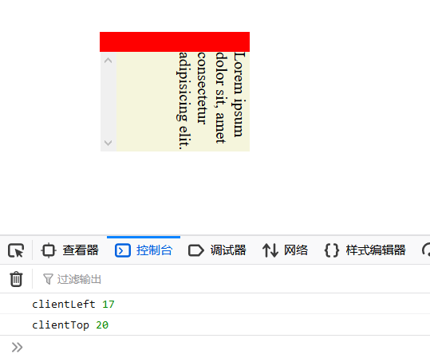

```css
writing-mode: sideways-rl; /* 文本垂直/右向左 制造左边的滚动条(chrome暂时不支持) */
overflow-y: scroll;
overflow-x: hidden;
```


# HE.offsetParent 最近定位元素的位置

**`HTMLElement.offsetParent`** 是一个只读属性，返回一个指向最近的（指包含层级上的最近）包含该元素的定位元素或者最近的 `table,``td,``th,``body`元素。当元素的 `style.display` 设置为 "none" 时，`offsetParent` 返回 `null`。`offsetParent` 很有用，因为 [`offsetTop`](https://developer.mozilla.org/zh-CN/docs/Web/API/HTMLElement/offsetTop) 和 [`offsetLeft`](https://developer.mozilla.org/zh-CN/docs/Web/API/HTMLElement/offsetLeft) 都是相对于其内边距边界的。


 **`HTMLElement.offsetLeft`** 是一个只读属性，返回当前元素*左上角*相对于  [`HTMLElement.offsetParent`](https://developer.mozilla.org/zh-CN/docs/Web/API/HTMLElement/offsetParent) 节点的左边界偏移的像素值。

对块级元素来说，`offsetTop`、`offsetLeft`、`offsetWidth` 及 `offsetHeight` 描述了元素相对于 `offsetParent` 的边界框。

然而，对于可被截断到下一行的行内元素（如 **span**），`offsetTop` 和 `offsetLeft` 描述的是*第一个*边界框的位置（使用 [`Element.getClientRects()`](https://developer.mozilla.org/zh-CN/docs/Web/API/Element/getClientRects) 来获取其宽度和高度），而 `offsetWidth` 和 `offsetHeight` 描述的是边界框的尺寸（使用 [`Element.getBoundingClientRect`](https://developer.mozilla.org/zh-CN/docs/Web/API/Element/getBoundingClientRect) 来获取其位置）。因此，使用 `offsetLeft、offsetTop、offsetWidth`、`offsetHeight` 来对应 left、top、width 和 height 的一个盒子将不会是文本容器 span 的盒子边界。


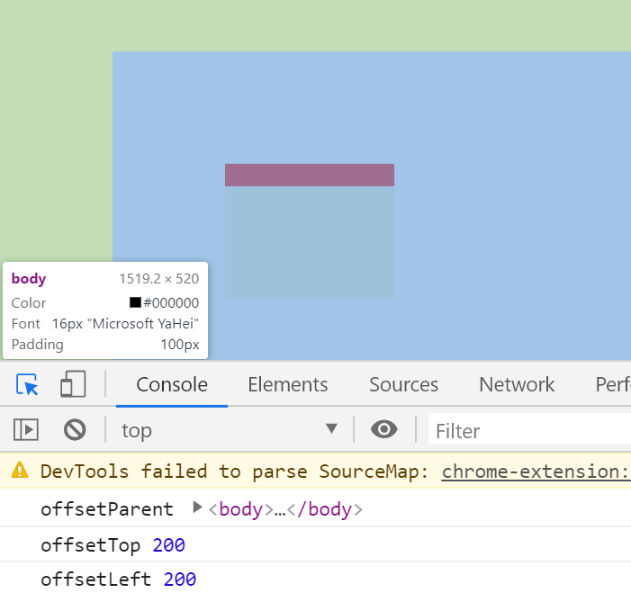


# E.scrollTop （滚动条的位置）

`Element.scrollTop` 属性可以获取或设置一个元素的内容垂直滚动的像素数。

一个元素的 `scrollTop` 值是这个元素的**内容顶部**（卷起来的）到它的视口可见内容（的顶部）的距离的度量。当一个元素的内容没有产生垂直方向的滚动条，那么它的 `scrollTop` 值为`0`。

在使用显示比例缩放的系统上，`scrollTop`可能会提供一个小数。

```html
   <style>
      * {
        padding: 0;
        margin: 0;
      }
      main {
        width: 100px;
        height: 100px;
        background-color: beige;
        border-top: 20px solid red;
        padding-left: 50px;
        margin: 100px;
        overflow: auto;
      }
    </style>
  </head>
  <body>
    <main>
      <div>
        Lorem ipsum dolor sit amet consectetur, adipisicing elit. Dicta quia
        nesciunt cupiditate, debitis quam in fugit pariatur repudiandae,
        quaerat, praesentium at. Dicta odit dolore modi assumenda officia ex
        veniam qui.
      </div>
    </main>
    <script>
      const main = document.getElementsByTagName('main')[0];
      console.log('scrollLeft', (a = main.scrollLeft));
      console.log('scrollTop', (b = main.scrollTop = 200));
    </script>
  </body>
```

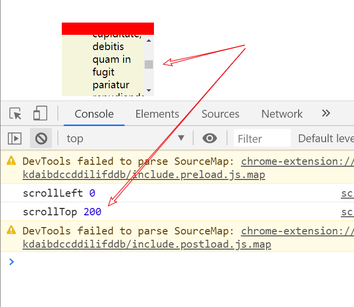

