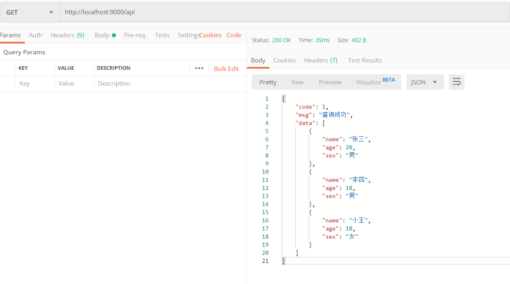

## 链接数据库

```javascript
const mysql = require('mysql');
const express = require('express');
const app = express();

app.listen(9000, () => {
    console.log('服务器启动');
});

const option = {
    host: 'localhost',
    user: 'root',
    password: '123456',
    port: '3306',
    database: 'nodetest',
    connectTimeout: 5000, //连接超时
    multipleStatements: false //是否允许一个query中包含多条sql语句
};
const conn = mysql.createConnection(option);

conn.connect((err) => {
    if (err) {
        console.log(err.stack);
        return;
    }
    console.log("连接数据库成功");
})

//结束连接
conn.end();
```

下面使用另一种方法连接数据库

**query能够隐式链接数据库**

```JavaScript
const conn = mysql.createConnection(option);
conn.query('SELECT * FROM students', function (error, results, fields) {
    if (error) throw error;
    console.log(results);
    // connected!
});
```

### 结束连接

出来上面的结束方法,还有

```JavaScript
conn.destroy()
```

没有回调函数,破坏式结束连接

## 读取举例

```JavaScript
const mysql = require('mysql');
const express = require('express');
const cors = require('cors');
const app = express();

app.use(cors());

app.listen(9000, () => {
    console.log('服务启动')
});

const option = {
    host: 'localhost',
    user: 'root',
    password: '123456',
    port: '3306',
    database: 'nodetest',
    connectTimeout: 5000, //连接超时
    multipleStatements: false //是否允许一个query中包含多条sql语句
};
const conn = mysql.createConnection(option);

app.get('/api', (req, res) => {
    conn.query("SELECT * FROM students", (e, r) => {
        if (e) {
            res.json(new Result({
                code: -1,
                msg: '查询错误',
            }))
        } else {
            res.json(new Result({
                code: 1,
                msg: '查询成功',
                data: r
            }));
        }
    })
});

function Result({
    code = 1,
    msg = '',
    data = {}
}) {
    this.code = code;
    this.msg = msg;
    this.data = data;
}
```



## 关于使用多条SQL语句

**为了安全起见，默认情况下是不允许执行多条查询语句的。**

```JavaScript
const mysql = require('mysql');

const option = {
  host: 'localhost',
  user: 'root',
  password: '123456',
  port: '3306',
  database: 'nodetest',
  connectTimeout: 5000, //连接超时
  multipleStatements: true //是否允许一个query中包含多条sql语句
};

const conn = mysql.createConnection(option);

conn.query("SELECT name FROM students;SELECT sex FROM students;SELECT age FROM students", (e, r) => {
  if (e) {
    console.log(e);
  } else {
    console.log(r[0]); //第一条语句的结果
    console.log(r[1]);
    console.log(r[2]);
  }
})
```

## 不止这没多,当然我选择放弃