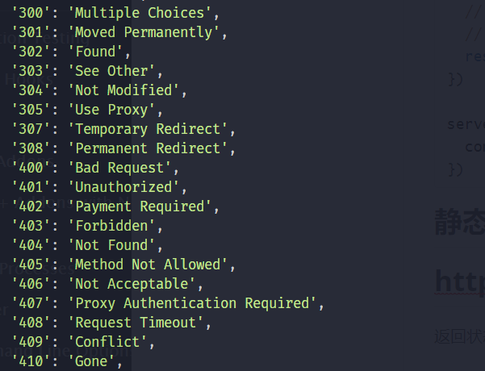

## 一个简单的服务

```javascript
const http = require('http');

const server = http.createServer();

//监听request事件
server.on('request', (request, response) => {
  console.log('收到请求了,请求路径是:' + request.url);
  // response.write('hello');
  // response.write(' nodejs');
  // response.end();
  response.end('hello world');
})

server.listen(3000, () => {
  console.log('服务器启动成功了');
})
```

## HTTP模块客户端

http模块提供了两个函数`http.request()`和`http.get()`,帮助程序向服务器端发送请求。

我们可以通过`http.request ()`方法创建一个发送请求的`http.ClientRequest`类实例，请求创建后，并不会立即发送请求，我们还可以继续访问请求头：`setHeader(name, value)`、`getHeader(name)` 和 `removeHeader(name)` API 进行修改。实际的请求头会与第一个数据块一起发送或当调用 `request.end()` 时发送。

### http.ClientRequest 类

http.ClientRequest类继承了EventEmitter,参见官方文档

### 发送GET请求

```JavaScript
const http = require('http');

let request = http.request({
    protocol: 'http:', // 请求的协议
    host: 'www.baidu.com', // 请求的host
    port: 80, // 端口
    method: 'GET', // GET请求
    timeout: 2000, // 超时时间
    path: '/' // 请求路径
  },
  res => { // 连接成功后，接收到后台服务器返回的响应，回调函数就会被调用一次。
    // res => http.IncomingMessage : 是一个Readable Stream
    res.on('data', data => {
      console.log(data.toString('utf8')); // 打印返回的数据。
    });
  }
);

// 设置请求头部
request.setHeader('Cache-Control', 'max-age=0');

// 真正的发送请求
request.end();
```

### 发送GET请求(方法2)

- http.get(options[, callback])
- http.get(url[, options\][, callback])]

这是上面的简化,不需要指定GET方法,也不需要手动`end()`

```JavaScript
http.get('http://www.baidu.com', res => {
  res.on('data', data => {
    console.log(data.toString('utf8'));
  });
});
```

### 发送POST请求

```JavaScript
const http = require('http');

let request = http.request({
    protocol: 'http:',
    host: 'www.baidu.com',
    port: 80,
    method: 'POST',
    timeout: 2000,
    path: '/'
  },
  res => {
    res.on('data', data => {
      console.log(data.toString('utf8'));
    });
  }
);
// 发送请求的数据。
request.write('id=3&name=aicoder');
request.end();
```

## HTTP服务器端

### http.server对象的事件

http.server是一个基于事件的HTTP服务器，所有的请求都被封装到独立的事件当中，我们只需要对他的事件编写相应的行数就可以实现HTTP服务器的所有功能，它继承自EventEmitter.

下面举例一个事件,更多参考官方文档

`request`：当客户端请求到来的时候，该事件被触发，提供两个参数`request`和`response`，分别是`http.ServerRequest`和`http.ServerResponse`表示请求和响应的信息。(这两个类中的api在官方文档中为一级标题)

由于`request`比较常用,我们可以使用捷径`http.createServer([requestListener])`,下面给出两个例子

```javascript
const http = require('http');

let server = new http.Server();
server.on('request', (req, res) => {
  console.log(req.url);
  //设置应答头信息
  res.writeHead(200, {
    'Content-Type': 'text/html'
  });
  res.write('hello we are family<br>');
  res.end('server already end\n');
});
server.listen(8080);
```

```JavaScript
const http = require('http');

const server = http.createServer((request, response) => {
  console.log('收到请求了,请求路径是:' + request.url);
  console.log('响应状态: ' + response.statusCode);
  response.end('hello world');
});

server.listen(3000, () => {
  if (server.listening === true) {
    console.log('服务启动成功');
  }
})
```

### 获取GET请求内容

```JavaScript
const http = require('http');
const url = require('url');
const util = require('util');

http
  .createServer((req, res) => {
    //利用url模块去解析客户端发送过来的URL
    res.write(util.inspect(url.parse(req.url, true)));
    res.end();
  })
  .listen(8080);
```

### 获取POST请求内容

POST请求的内容全部都在请求体中，`http.ServerRequest`并没有一个属性内容为请求体，原因是等待请求体传输可能是一件耗时的工作。譬如上传文件。恶意的POST请求会大大消耗服务器的资源。所以Nodejs是不会解析请求体，当你需要的时候，需要手动来做。

```JavaScript
const http = require('http');
const util = require('util');
const querystring = require('querystring');

http
  .createServer((req, res) => {
    let post = '';
    req.on('data', chunk => {
      post += chunk;
    });
    req.on('end', () => {
      post = querystring.parse(post);
      res.end(util.inspect(post));
    });
  })
  .listen(3000);
```


## 静态属性

### http.STATUS_CODES 

**返回状态码**,下面图只是部分



### http.METHODS

**解析器支持的http方法**

