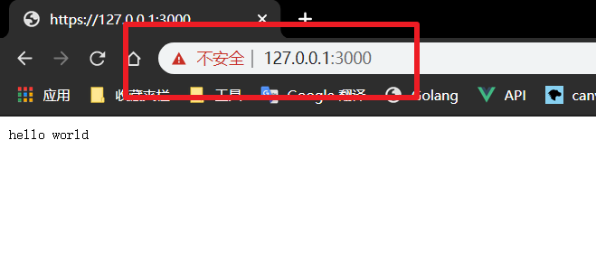

## 模块使用

和http差不多


## 生成证书信息


**不得不说,自己生成证书模仿证书颁发机构是失败的,所以下面只是演示了使用https的过程**


使用工具openssl 安装git后,可以在git bash中直接使用

1. 生成私钥key文件：

   ```bash
   openssl genrsa -out myca.key 2048
   #		加密方式  输出  文件  大小/默认2048
   ```

2. 通过私钥生成CSR证书签名  （需要填一些信不的不熟息、可直接回车）

   ```bash
   openssl req -new -key myca.key -out myca.csr
   ```

3. 通过私钥和证书签名生成证书文件

   ```bash
   openssl x509 -req -in myca.csr -extensions v3_ca -signkey myca.key -out myca.crt
   ```

## 启动服务器

```JavaScript
const https = require('https'),
  fs = require("fs");

const options = {
  key: fs.readFileSync('./myca.key'),  //读取密匙信息
  cert: fs.readFileSync('./myca.crt')
};

https.createServer(options, (request, response) => {
  console.log('收到请求了,请求路径是:' + request.url);
  console.log('响应状态: ' + response.statusCode);
  response.end('hello world');
}).listen(3000)
```

**前面说过,自己没能成功自建证书,所以会被提示不安全**

