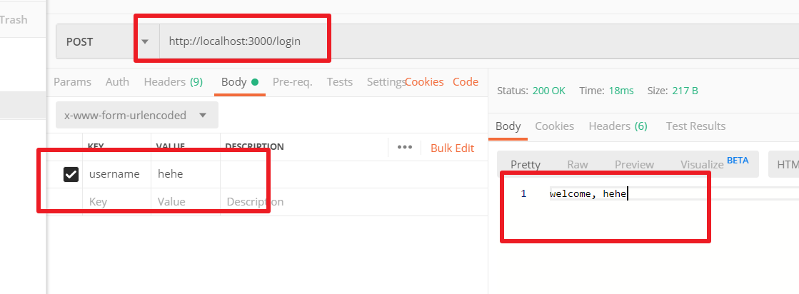
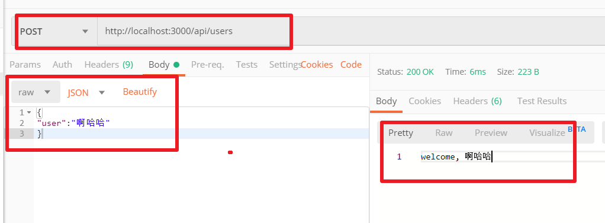

## 一个简单的服务

```javascript
const express = require('express')
const app = express()

app.get('/', function (req, res) {
  res.send('Hello World')
})

app.get('/api', (req, res) => {
  res.json({
    user: 'tobi'
  })
})

app.listen(3000)
```

## 静态文件

```JavaScript
const express = require('express')
const path = require('path')
const app = express()
app.use('/public', express.static(path.join(__dirname, 'public')))
console.log(path.join(__dirname, 'public'));

app.get('/', (req, res) => {
  res.send('hello world');
})

app.listen(8080, () => {
  console.log("成功");
})
```

访问`http://localhost:8080/public/文件`

## 中间件举例

`express`不支持请求体,使用`body-parser`解决这个问题

```JavaScript
var express = require('express')
var bodyParser = require('body-parser')

var app = express()

// create application/json parser
var jsonParser = bodyParser.json()

// create application/x-www-form-urlencoded parser
var urlencodedParser = bodyParser.urlencoded({
  extended: false
})

//使用中间件方法1
// app.use(urlencodedParser);

// POST /login gets urlencoded bodies
app.post('/login', urlencodedParser, function (req, res) {
  res.send('welcome, ' + req.body.username)
})

// POST /api/users gets JSON bodies
//使用中间件方法2
app.post('/api/users', jsonParser, function (req, res) {
  res.send('welcome, ' + req.body.user)
})

app.listen(3000);
```







## Router

路由有什么作用看下面例子

```javascript
const express = require('express');
const cats = require('./cats');

const app = express();

app.use('/cats', cats);

app.listen(3000);
```


```JavaScript
const express = require('express');

const router = express.Router();

router.get('/', function (req, res) {
  res.send('<h1>/cats<h1>');
});

router.get('/miaomiao', function (req, res) {
  res.send('<h1>/cats/miaomiao<h1>');
});

module.exports = router;
```

生成的接口是:

`/cats`

`/cats/miaomiao`

## 参考链接

模块的使用比较多,具体直接去文档查阅更方便,上面只是做一个引子

https://www.runoob.com/nodejs/nodejs-express-framework.html

http://expressjs.com/