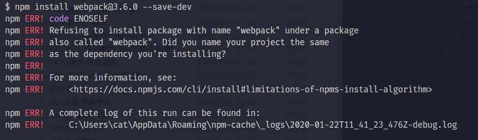
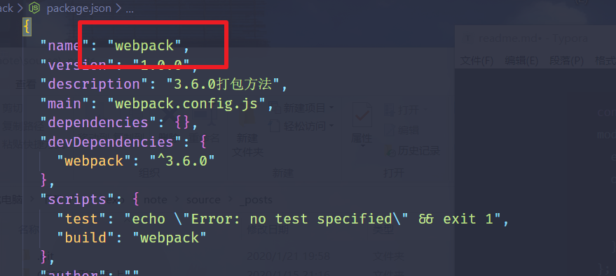
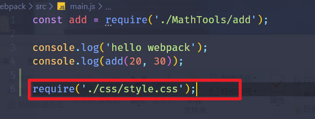
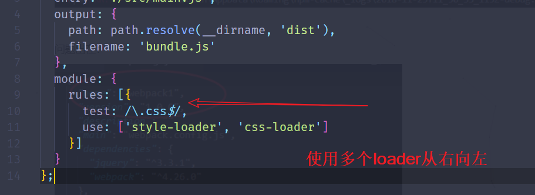
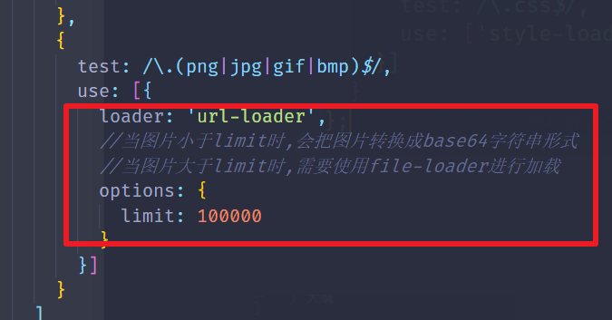
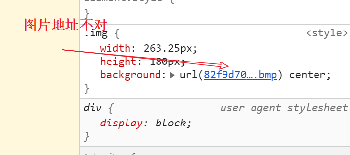
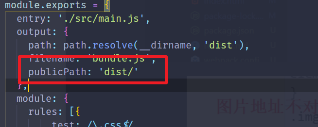
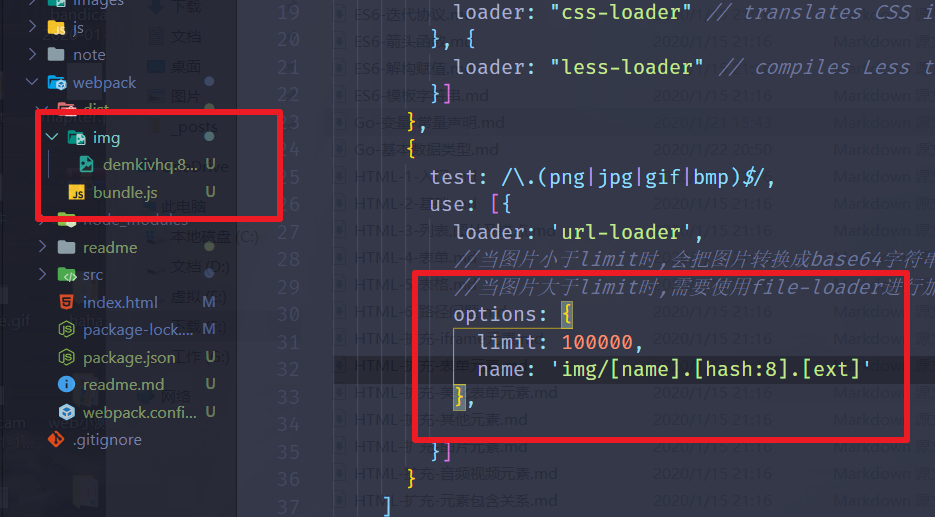

3.6.0打包方法

```bash
  webpack ./src/main.js ./dist/hundle.js
```

```bash
  npm init  //初始化
```

创建`webpack.config.js`

```javascript
const path = require('path');
module.exports = {
  entry: './src/main.js',
  output: {
    path: path.resolve(__dirname, 'dist'),
    filename: 'bundle.js'
  }
};
```

安装局部webpack出现下面错误时,是你把文件夹也创建成了webpack(测试时乱取名字的锅),node把当前项目配置成了webpack,改一下就好(比如改成webpack-learn)





让webpack注意到css文件






处理图片时注意



但是用file-loader又有问题




解决办法`webpack.config.js`中增加一个变量(当然是不是要这样做是和index.html位置有关系)



如果觉得图片放的位置比较乱可以处理一下



